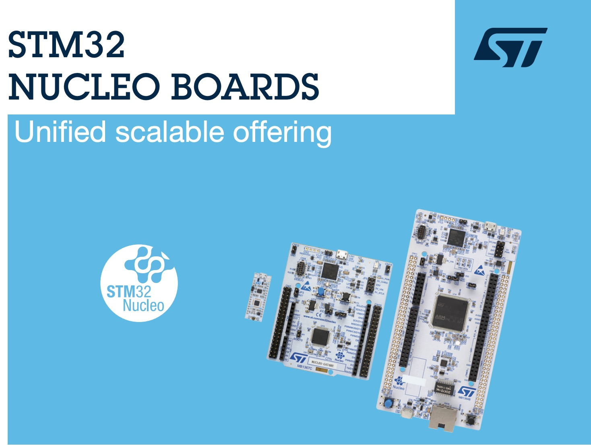

# Embedded Systems Programming on ARM Cortex-M3/M4 Processor

Notes, exercises, and code from FastBit Embedded Brain Academy's ARM Cortex-M3/M4 course on Udemy.

**Instructor:** Kiran Nayak  
**Platform:** Udemy  
**Hardware:** STM32 Nucleo (ARM Cortex-M4)  
**Tooling:** STM32CubeIDE, VS Code, Obsidian

---

## Progress

### Section 1: Introduction
- [x] Lecture: Motivation, why use ARM
- [x] Lecture: Processor vs. Processor Core 

### Section 2: Hardware/Software Requirements
- [x] Downloading: STM32CubeIDE and VSCode Extension
- [x] Lecture: Embedded Target for this Course
- [x] Documents: User Manuals, Datasheets, Images, and Schematics 

### Section 3: IDE Installation
- [ ] Optimizing for VSCode in my specific use case
- [ ] Embedded Target

### Section 4: Embedded Hello World
- [ ] Create HelloWorld project
- [ ] Printf using SWV
- [ ] Testing HelloWorld
- [ ] Printf using semihosting

### Section 5: Bare Metal Programming
- [ ] Writing a linker script from scratch
- [ ] Writing a startup file from scratch
- [ ] Build process and makefiles

### Section 6: Task Scheduler
- [ ] SYSTICK and PENDSV
- [ ] Implementing a simple task scheduler

### Section 7: Stack and AAPCS
- [ ] Stack overview
- [ ] ARM AAPCS calling convention
- [ ] Fault analysis and handling

### Section 8: Inline Assembly
- [ ] GCC inline assembly syntax
- [ ] Mixed C and assembly coding

---

## FastBit Learning Path

| # | Course | Status |
|---|--------|--------|
| 1 | Microcontroller Embedded C: Absolute Beginners | Skipped (prior experience) |
| 2 | **Embedded Systems Programming on ARM Cortex-M3/M4** | In progress |
| 3 | Mastering Microcontroller with Embedded Driver Development (MCU1) | Not started |
| 4 | Mastering Microcontroller: Timers, PWM, CAN, Low Power (MCU2) | Not started |
| 5 | Mastering Microcontroller: STM32-LTDC, LCD-TFT, LVGL (MCU3) | Not started |
| 6 | Embedded System Design using UML State Machines | Not started |
| 7 | Mastering RTOS: Hands-on FreeRTOS and STM32Fx | Not started |
| 8 | ARM Cortex M Microcontroller DMA Programming | Not started |
| 9 | STM32Fx Microcontroller Custom Bootloader Development | Not started |
| 10 | Embedded Linux Step by Step using Beaglebone Black | Not started |
| 11 | Linux Device Driver Programming using Beaglebone Black | Not started |
